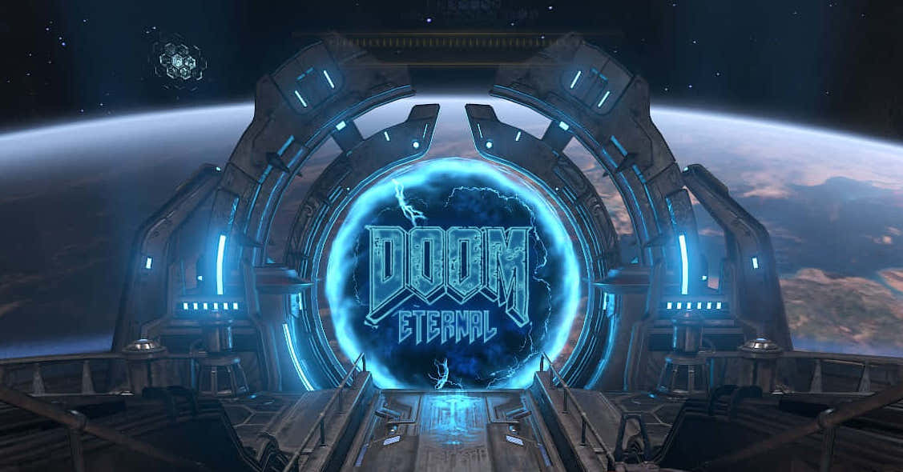

# SlaySat 🛰️ 



_Créditos imagen: [wallpapers.com](https://wallpapers.com)_

_README original de _Chocolate Doom_ [aquí](README.chocolate-doom.md)_

Este es un proyecto para el [HackUDC 2026](https://hackudc.gpul.org), que
consiste en ejecutar Doom en un satélite (hipotético) y jugarlo desde la Tierra.

## 📐 Arquitectura

La idea es emplear un protocolo de transmisión a prueba de entornos de red
hostiles (alta latencia, pérdida de paquetes, ancho de banda limitado...)
manteniendo la jugabilidad.

De esta manera se intenta simular la comunicación de un satélite (_servidor_),
donde se ejecuta el motor del juego, y una estación en tierra (_cliente_) donde
se visualiza el juego y se toman acciones.

### 📡 Definición y asunciones de misión

Dado que el objetivo es simular la comunicación con un satélite, se han asumido
ciertas características de su entorno para aproximar las pruebas realizadas
durante el desarrollo a una situación real:

- **Orbita Geoestacionaria (GEO):** La conexión puede establecerse de forma 
  continuada y sin interrupciones causadas por su trayectoria.
- **Alta latencia espacial:** Dada la distancia entre la superficie terrestre
  y el satélite (~36.000km), se asume un RTT (Round Trip Time) de entre 500-600 ms.
- **Radiación y packet loss:** Debido a la falta de protección ante ondas
  electromagnéticas en el espacio, la posibilidad de que un paquete se pierda 
  o de "Bit flips" durante su transmisión es crítica.

Teniendo esto en cuenta, esta versión modificada de Chocolate DOOM prioriza
adaptarse a estas situaciones frente a proporcionar una experiencia de juego
idéntica al juego en local.

## Eficiencia de enlace

Transmitir video crudo saturaría el enlace satelital al instante. Por ello, 
hemos diseñado un _protocolo binario custom_ que logra mantener el consumo de
ancho de banda por debajo de 500Kbps mediante un pipeline de compresión dinámico:

1. **Byte-Packaging**
   Renderizamos el juego internamente a 160x100 y a un framerate reducida en 
   un ratio de 5. Mapeamos los 256 colores a una escala de 16 tonos de grises 
   (4 bits). Así, 2 píxeles pueden ser empaquetados en un solo Byte.
2. **Compresión dinámica**
   Según el ruido visual de cada frame se pueden emplear:
   - **Algoritmo Delta**: para movimientos en los que apenas hay ruido, 
   únicamente se mandan los píxeles modificados [Y, X, Color].
   - **Compresión RLE (Run Length Encoding) / RAW:** en el caso contrario 
   donde el ruido es considerable, los píxeles adyacentes de un mismo color se 
   agrupan [Cantidad, Color]. 
   
## Resiliencia y latencia
En el espacio, un bit volteado por posibles radiaciones puede dar lugar a errores
Para evitarlo, hemos planteado un _Forward Error Correction (FEC)_ por sofware:
   - **Headers inmunes con Hamming(7,4):** El header indica la forma de 
   descompresión al cliente (0=RAW, 1=DELTA, 2=RLE). Este header se transmite
   entrelazado con 3 bits de paridad. De esta forma, si 1 bit es alterado, se 
   calcula el Síndrome detectando el error y reparándolo al momento.
   - **Checksum (XOR):** Los datos visuales llevan un último byte a forma de 
   "firma". Si el frame llega corrupto, se descarta sin congelar el juego.
   - **Comandos asíncronos (uplink):** Las pulsaciones del teclado se transmiten 
   de Tierra al Satélite en paquetes diminutos(D:Tecla, U:Tecla) a través del 
   socket no bloqueante, garantizando máxima fluidez a pesar de la latencia.
   

## 💡 Probar el proyecto

Todo funciona con ✨[Nix & NixOS](https://nixos.org)✨ así que es tan sencillo
como:
- Compilar: `nix build`
- Entorno desarrollo: `nix develop` 

Simular el entorno espacial (Latencia GEO)
- Añadir latencia:
  ```
  sudo tc qdisc add dev wlp4s0 root netem delay 500ms
  ```
- Limpiar la red:
  ```
  sudo tc qdisc del dev wlp4s0 root netem 
  ```

Ejecutar el programa:
- Servidor (Chocolate Doom):
  ```
  DOOM_CLIENT_ADDR=127.0.0.1 \
  DOOM_CLIENT_PORT=6666 \
  SDL_VIDEODRIVER=dummy \
  DOOM_SERVER_PORT=7777 \
  ./result/bin/chocolate-doom -iwad DOOM.wad
  ```
- Cliente:
  ```
  DOOM_SAT_ADDR=127.0.0.1 \
  DOOM_LISTEN_PORT=6666 \
  python3 cliente.py
  ```

**Nota importante**: Es necesario el archivo `DOOM.wad` (u otro archivo iwad) para utilizar Chocolate Doom ([más info.](https://doomwiki.org/wiki/IWAD))
